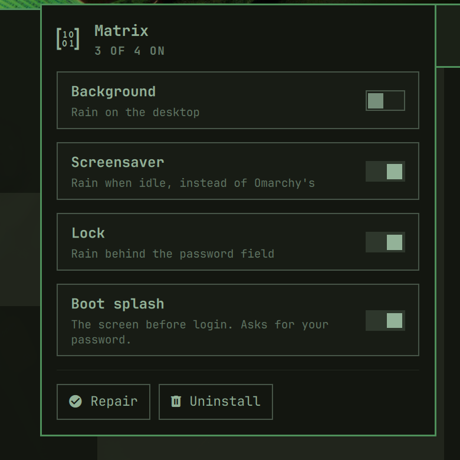

# Matrix Widget

The bar widget for the [Matrix pack for Omarchy](https://github.com/tymurbogach/omarchy-enter-the-matrix-theme):
one icon on your bar, and a panel with four switches — desktop rain,
screensaver, lock, and boot splash — plus Repair and Uninstall.



This widget owns no state of its own. Every question it asks goes to the
`omarchy-matrix` CLI (`omarchy-matrix status --json`), which is installed by
the main pack. **Installed alone, without the rest of the pack, the icon
appears dimmed and the panel has nothing to report** — that is expected, not
a bug, and is exactly how it behaves today when the pack is stood down for
another theme.

## Install

The normal way is automatic: installing the
[Matrix pack](https://github.com/tymurbogach/omarchy-enter-the-matrix-theme) via its
own `install.sh` fetches this repo and stages it for you. You do not need to
add it separately.

To add just this widget on its own (for development, or if you already have
the rest of the pack installed some other way):

```bash
omarchy plugin add https://github.com/tymurbogach/omarchy-matrix-widget --enable
```

## Remove

```bash
omarchy plugin remove io.github.tymurbogach.enter-the-matrix.widget
```

If you installed the full pack, use its own uninstaller instead
(`omarchy-matrix uninstall`), which also hands back the lock, screensaver and
boot splash it took over.

## Requirements

Part of the Matrix pack: it needs the pack's `omarchy-matrix` CLI on PATH
(Omarchy 4.0.3), which the pack's own `install.sh` puts there.

## License

MIT.